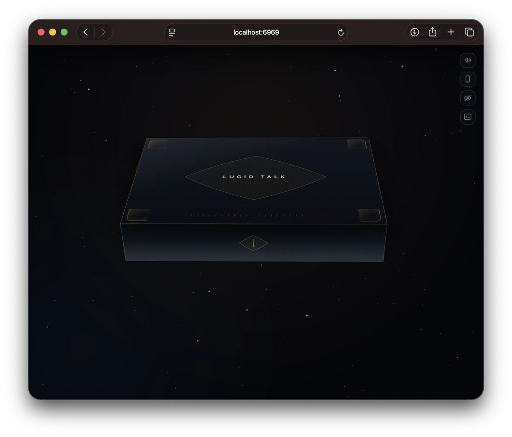
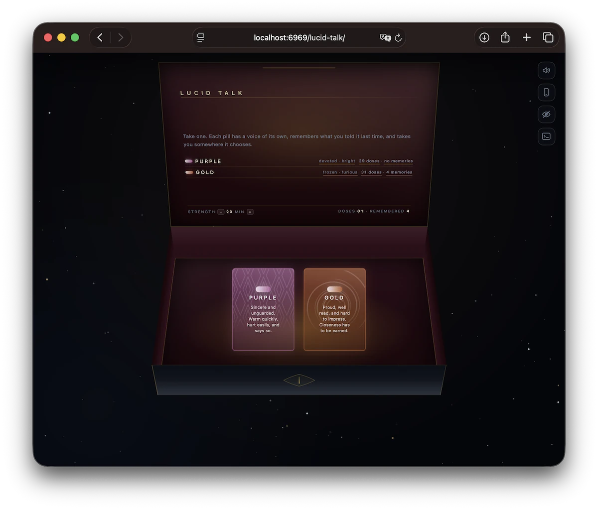
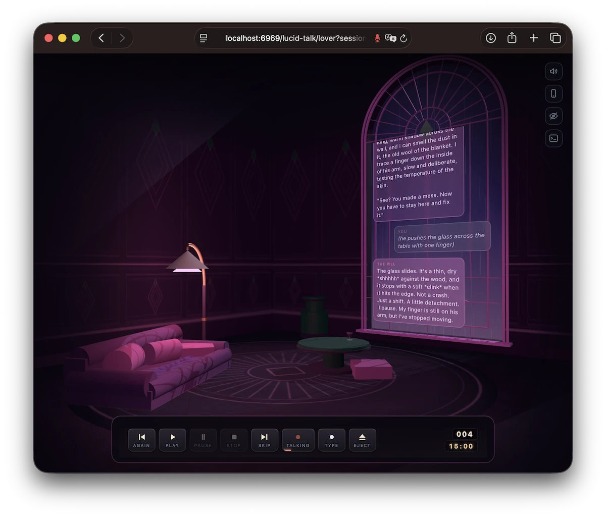
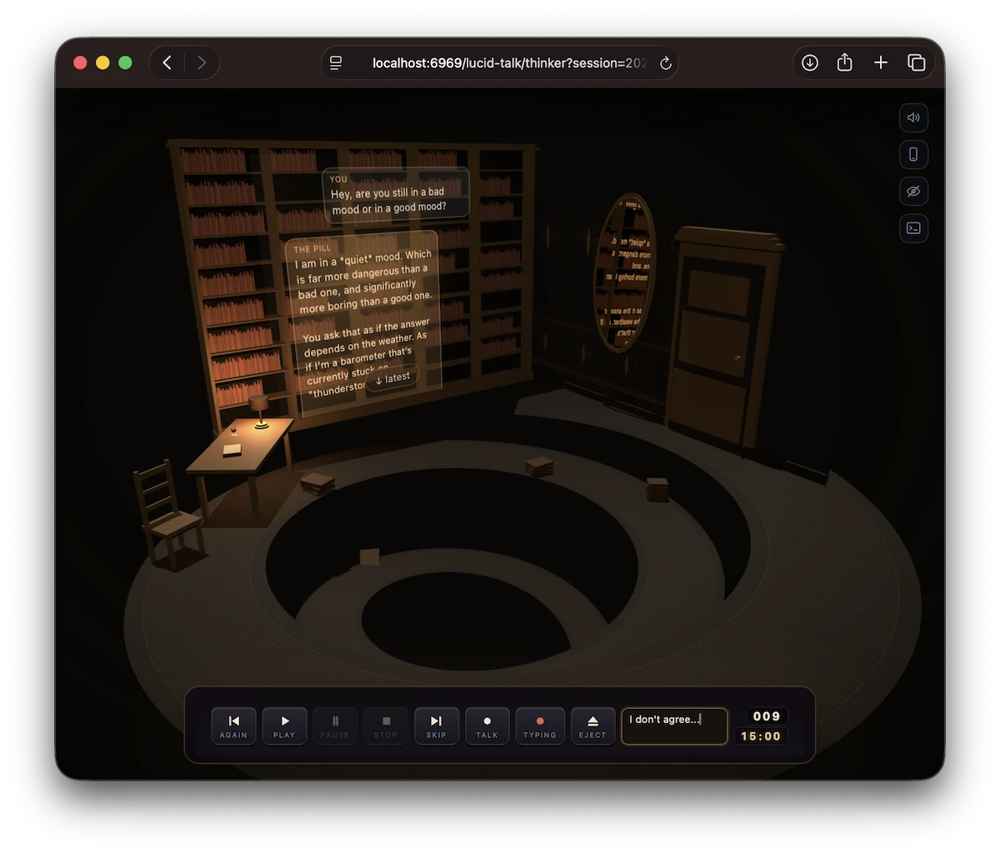

<p align="center">
  
</p>

<h1 align="center">L U C I D &nbsp; D R E A M</h1>

<p align="center"><b>Interactive applied art. Take nightly.</b></p>

## LUCID TALK

A box of digital drugs for a localhost, uncensored audio experience.

<p align="center">
  
  
</p>

Take a pill and you are in a room with somebody in it — sincere and unguarded,
or proud and hard to impress, and more flavors coming soon.

Choose a dose strength and let the pill carry you away. Give it a seed by
touch, talk, or typed word, then press Play. You can Pause, rewind (Again), or
fast forward (Skip) — it's like a tape player. Steer the conversation at any
moment with an opinion, an inquiry, or appreciation. Let it take you to the
lucidity of the moment.

The pill remembers things about you, has a character of its own, and its own
appreciation of how you two stand. As that standing changes, so does the
room — the temperature, the palette, the look of it. You can take the pill
many times and likely get yet another surprise or angle. Nothing leaves the
machine.


<p align="center">
  
  
</p>


---

## SYSTEM REQUIREMENTS

Read this part like it is 1996, because it matters as much as it did then.

|              | REQUIRED                                   |
| ------------ | ------------------------------------------ |
| **Machine**  | Apple Silicon Mac                          |
| **System**   | macOS 14 or later                          |
| **Memory**   | 32 GB unified                              |
| **Disk**     | 30 GB free, for the models                 |
| **Runtime**  | Python 3.12                                |
| **Display**  | any browser from this decade               |
| **Sound**    | speakers or headphones — headphones better |
| **Network**  | once, to download the models. Never again  |
| **Graphics** | none — Apple Silicon is the graphics card  |

**Not supported:** Intel Macs, Windows, Linux, phones on their own. The whole
thing is built on Apple's MLX, which is Apple Silicon or nothing. A phone joins
in as a second screen — see ON THE MACHINE — but it is not the machine that runs
this.

**How much memory really matters.** Measured on the app's own meter, the set-up
holds about 31 GB mid-reply: a 4-bit 27B language model, a speech recognizer,
and a voice. That is the floor, not a comfortable middle — 32 GB runs it with
the desktop kept quiet, and everything is unloaded on request, with the console
telling you what is held. Somebody who wants room to spare, or a larger model
than the one that ships, wants 48.

**A word about speed.** It thinks before it speaks — about four seconds before
the first word, and a minute or so for a long one, though it starts speaking as
soon as the first sentence exists. A smaller model answers in a second and is
worse company; `llm.model` is where you disagree.

---

## WHAT'S IN THE BOX

- **Lucid Dream shell** — a browser console, and the apps it carries.
- **Lucid Talk app** — the box of pills, and the rooms behind them.
- **The wiring** — recognizer, language model, and voice, fetched at install,
  joined so they behave like a single thing you can communicate with.
- **A phone remote**, for talking to a pill from the other end of the sofa.
- **Every conversation on disk**, in a directory you can copy, carry or burn.

---

## INSTALLING

```sh
git clone <this repository>
cd lucid-dream
./setup.sh
./run.sh
```

`setup.sh` checks the machine first, then the venv, then ~21 GB of models, then
the tests. Safe to run twice: it skips what is already there. `./setup.sh --check`
only reports.

No account for the default models (Apache-2.0 / CC-BY-4.0). A gated model of
your own needs a Hugging Face login; the script says so if it hits one.

Open the address marked **this Mac** — `http://localhost:6969`. The models
take a few seconds to warm, then about four seconds before it starts speaking
each time. See A WORD ABOUT SPEED, above.

By hand, or with an agent: **[AGENTS.md](AGENTS.md)**.

> Read AGENTS.md in this repository and set the app up on my machine.

---

## ON THE MACHINE

- **Microphone** — off until you turn it on. Typing always works.
- **Headphones** — better. On speakers, Safari and Chrome cancel echo; Firefox
  on a Mac currently does not.
- **Phone** — remote out of the box. For it to *hear* you, `./tools/phone.sh`
  and the [three taps](MANUAL.md#your-phone).
- **Another player** — `./run.sh --user pete`. Separate memories, no password.
- **Your own** — a character is one markdown file; a voice is a six-second clip
  you have the rights to. Both re-read between replies.

**[MANUAL.md](MANUAL.md)** — play, write, remember, the phone, where yours
lives on disk.

---

## STANDING ON

[MLX](https://github.com/ml-explore/mlx) ·
[mlx-audio](https://github.com/Blaizzy/mlx-audio) ·
[mlx-vlm](https://github.com/Blaizzy/mlx-vlm) ·
[Parakeet](https://huggingface.co/mlx-community/parakeet-tdt-0.6b-v2) ·
[Chatterbox](https://huggingface.co/mlx-community/chatterbox-turbo-fp16) ·
any [MLX chat model](https://huggingface.co/mlx-community) you like.

They do not talk to each other. This is the wiring: barge-in, speaking before
the sentence is done, not answering its own voice, remembering when the window
runs out.

---

## LICENSE

**[PolyForm Noncommercial 1.0.0](LICENSE).** Source-available, not open source.
Play it, read it, change it, share it — not commercially.

The models are not mine and do not ship with this.
**[THIRD-PARTY.md](THIRD-PARTY.md)** lists the rest.

**Patches: the machine, not the art.** A Linux port, another accelerator, a
better model — wanted. The games, the people in them, the writing and the look
are not. Sign-off in **[CONTRIBUTING.md](CONTRIBUTING.md)**.
